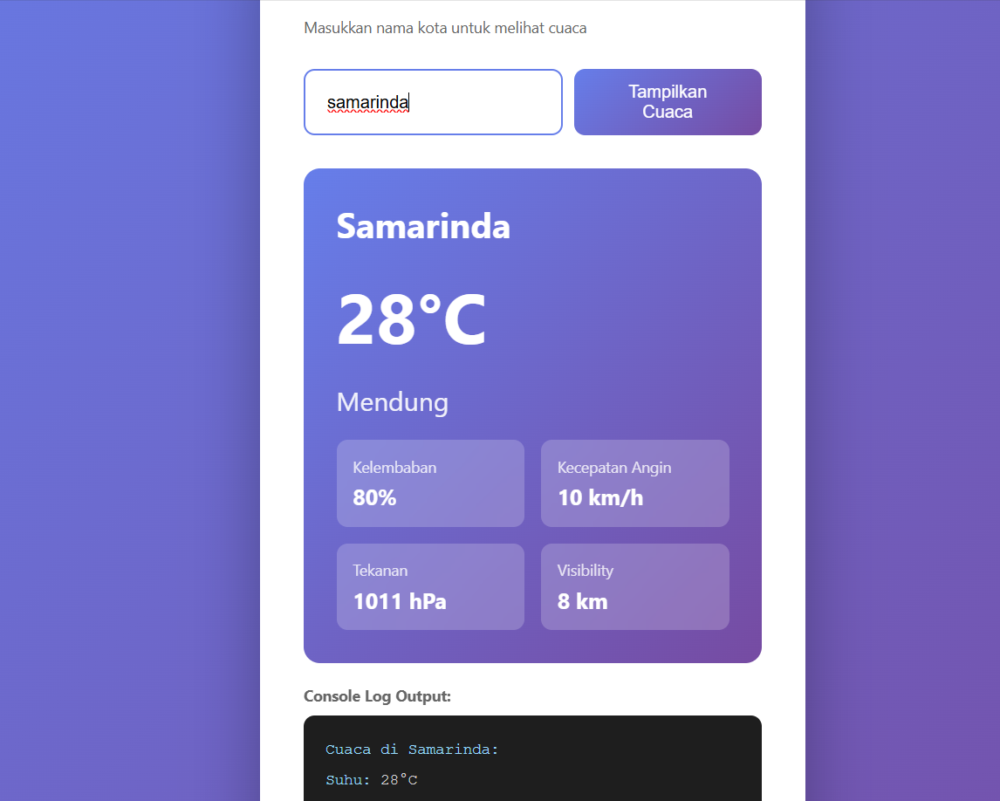

# Weather Dashboard 🌤️

Website cuaca sederhana tanpa API eksternal

## 📋 Fitur
- 8 kota di Indonesia
- Data cuaca lengkap
- Console log output
- Design modern

## 🚀 Cara Menggunakan

1. Clone repository:
```bash
git clone https://github.com/username/weather-dashboard.git
```

2. Buka file `index.html` di browser

## 💻 Teknologi
- HTML5
- CSS3
- JavaScript (Vanilla)

## 📝 Code Preview

### Struktur Data
```javascript
const weatherData = {
    "Samarinda": {
        temperature: 28,
        condition: "Mendung"
    }
};
```

### Fungsi Utama
<details>
<summary>Lihat kode lengkap fungsi getCuaca()</summary>
```javascript
function getCuaca() {
    const cityInput = document.getElementById('cityInput').value.trim();
    const weatherInfo = document.getElementById('weatherInfo');
    const errorMsg = document.getElementById('errorMsg');
    
    errorMsg.style.display = 'none';
    
    const cityKey = Object.keys(weatherData).find(
        key => key.toLowerCase() === cityInput.toLowerCase()
    );

    if (cityKey) {
        const data = weatherData[cityKey];
        document.getElementById('cityName').textContent = cityKey;
        document.getElementById('temperature').textContent = data.temperature + '°C';
        weatherInfo.style.display = 'block';
        
        console.log(`Cuaca di ${cityKey}:`);
        console.log(`Suhu: ${data.temperature}°C`);
    } else {
        errorMsg.textContent = `Data tidak tersedia`;
        errorMsg.style.display = 'block';
    }
}
```

</details>

## 📸 Screenshot


## 📄 License
MIT License
